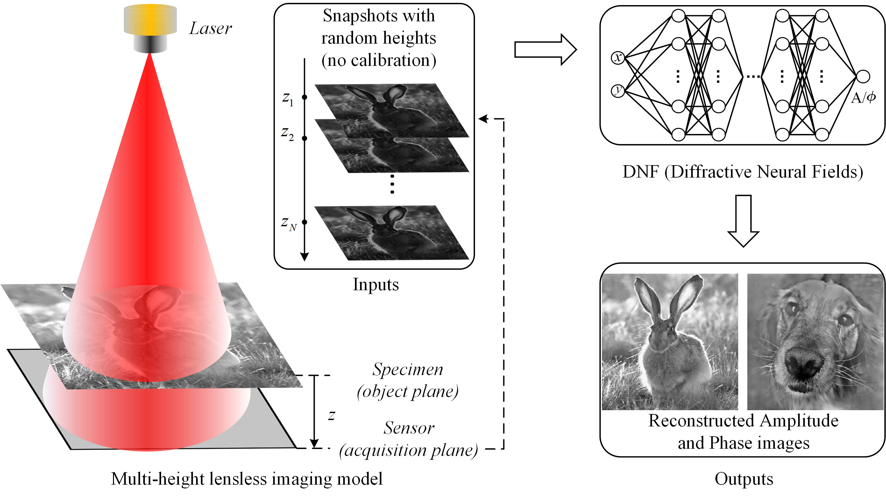
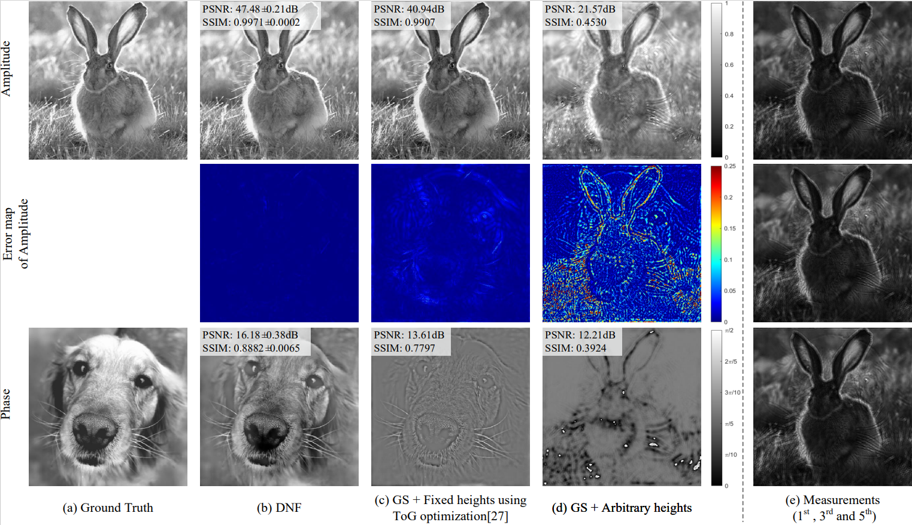

# DNF
Pytorch implementation for paper ''DNF: Diffractive Neural Field for Lensless Microscopic Imaging''.

## Pipeline


## Setup

Dependencies:

* python 3.7
* pytorch 1.9.1
* cuda 11.1
* cudnn 8.0.5
* pytorch-lightning 0.7.5
* matplotlib 3.3.4

We provide a conda environment setup file including all of the above dependencies. Create the conda environment DNF by running:
```
conda create -n dnf python=3.7
pip install -r requirements.txt
```

## Running code

* simulation experiment
```
python train_simulation.py \
	--exp_name='exp_simulation'
```
* simualtion & joint training 
```
python train_simulation.py \ 
	--exp_name='exp_simulation_joint' \
	--joint_training
```
* real-world data experiment
```
python train_real.py \
	--exp_name='exp_real'
```
* real-world data & joint training
```
python train_real.py \
	--exp_name='exp_real_joint' \
	--joint_training
```

## Results
Simulation results



## Citation
```
Hao Zhu, Zhen Liu, You Zhou, Zhan Ma, and Xun Cao, "DNF: diffractive neural field for lensless microscopic imaging," Opt. Express 30, 18168-18178 (2022)
```
